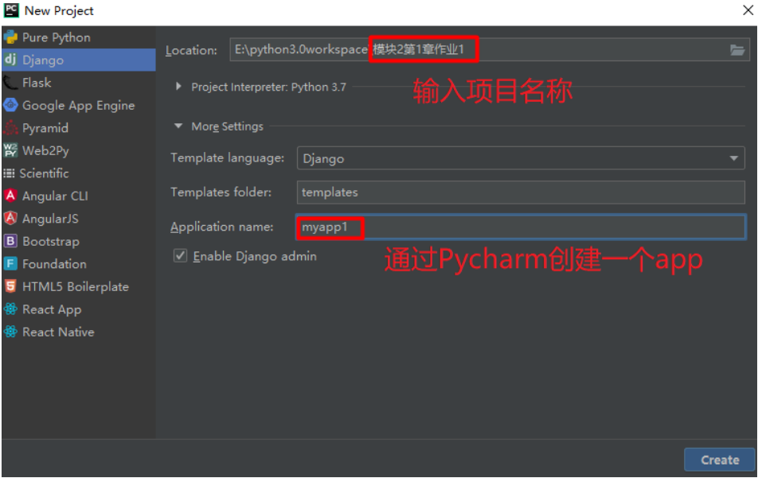
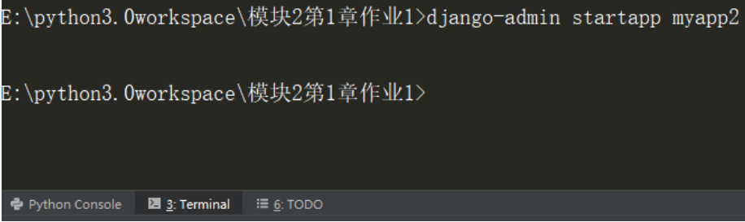
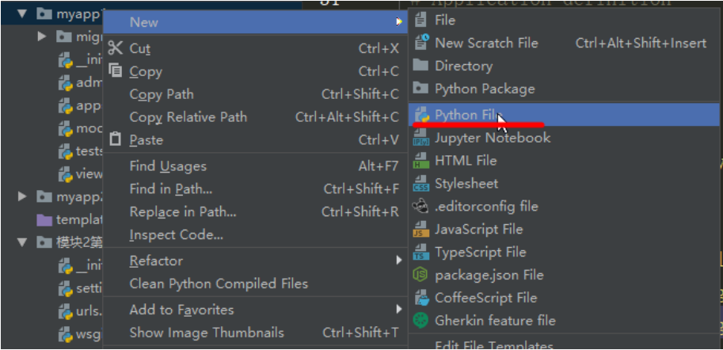
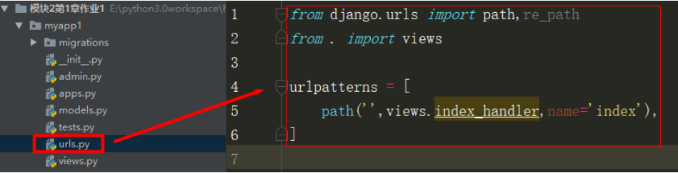
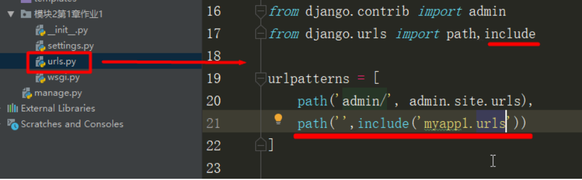
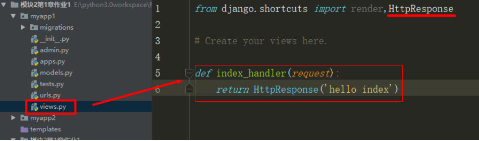

# 第三周作业1——Python后台开发基础

## 一、作业描述

* 通过Pycharm创建Django项目 

* 通过PyCharm创建一个App 

* 通过命令行创建App，并在settings中进行配置 

* 配置首页的路由映射 

* 在首页的视图函数中输出“hello index“ 

## 二、作业流程展示

### 2.1 PyCharm创建Django项目与App 



**注：社区版无左侧项目框架，需要使用命令行创建Django项目**

```python
# 先通过命令行进入到一个合适的路径(注意不要保存至系统路径下，推荐桌面或其他盘)
# 如果保存至其他盘，需要先更改盘符，如：>>>D:
cd 具体路径(如:D:\pythontest)
django-admin startproject mysite(项目名)
```

### 2.2 命令行创建app与settings配置

```python
 django‐admin startapp myapp2
```




### 2.3 配置路由

#### 2.3.1 配置子路由

* 创建urls.py 



* 编写代码 



#### 2.3.2 配置主路由



#### 2.4 编写视图函数



### 3 评分标准

* 创建Django项目与App 10分 

* 成功输出"hello index" 10分 

* 代码注释，规范10分