# 第三周作业2——Python后台开发基础

## 一、项目描述

* 制作一个在局域网中，可以共享文件，为其他访客提供下载服务的Web项目 

* 构建一个下载清单页，展示所有可供下载的文件以及链接 

**项目展示：** 

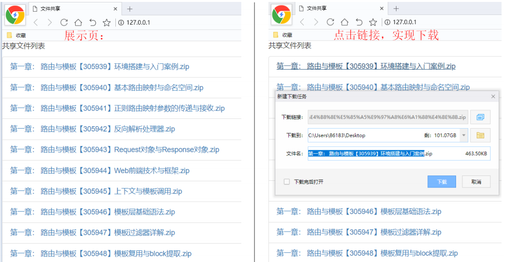

## 二、搭建项目 

### 2.1 创建Django项目

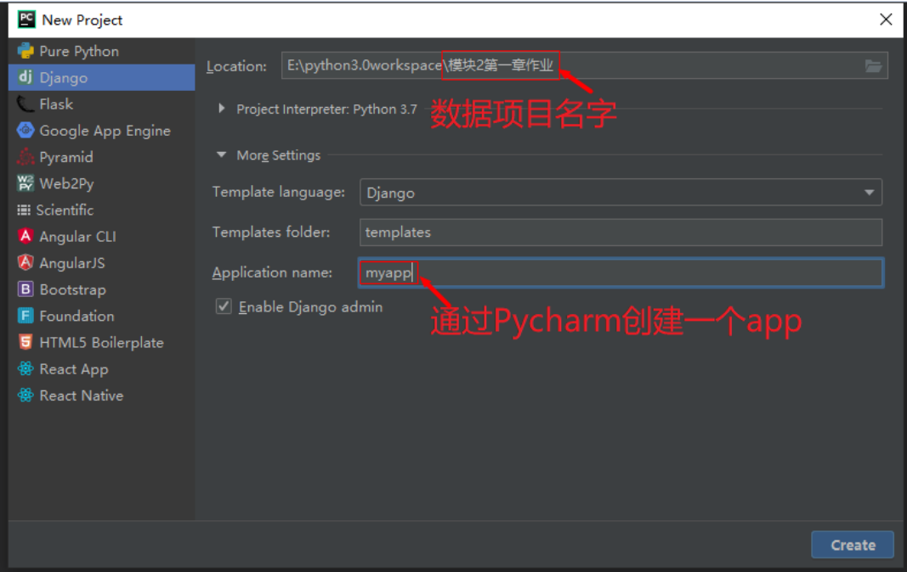

### 2.2 配置Settings中的静态访问

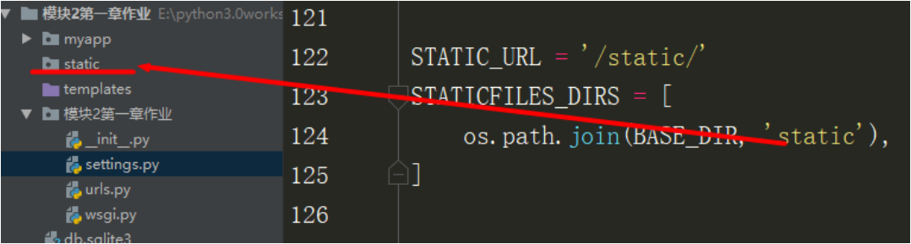

**静态文件的url** 

```python
STATIC_URL = '/static/' 
```

**静态文件夹地址** 

```python
STATICFILESDIRS = [os.path.join(BASEDIR, 'static'),] 
```

### 2.3 配置路由

#### 2.3.1 子路由配置

* 在myapp中新建一个urls 

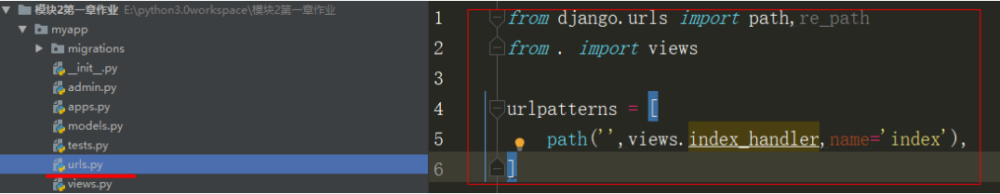

* 在urls.py中添加

```python
from django.urls import path,re_path
from . import views

urlpatterns = [
    path('',views.index_handler,name='index'), 
]
```

#### 2.3.2 配置总路由

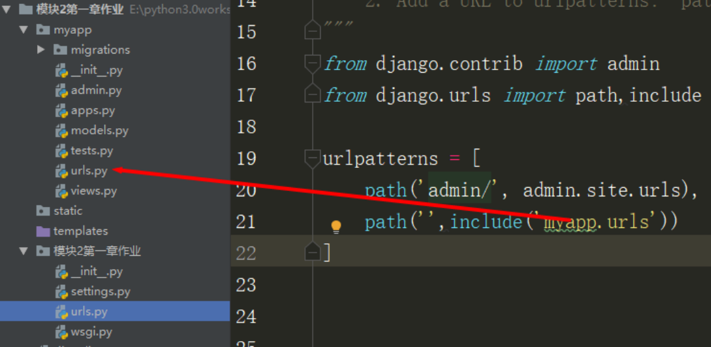

```python
from django.contrib import admin
from django.urls import path,include

urlpatterns = [
    path('admin/', admin.site.urls),
    path('', include('my.apps')),
]
```

### 2.4 配置视图函数

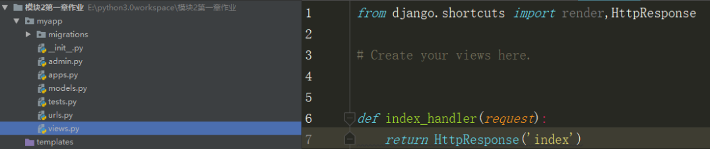

```python
from django.shortcuts import render,HttpResponse

# Create your views here

def index_handler(request):
    return HttpResponse('index')
```

### 2.5 运行项目

* 打开Pycharm的Terminal窗口，输入如下代码后运行：
  * python manage.py runserver 80(端口自设)
* 或是找到manage.py文件，CTRL+SHIFT+F10运行
  * 点击pycharm中右上方的manage.py
  * 在下拉选项中选择edit configurations...
  * 添加启动命令runserver 80
  * 再次运行manage.py
  * 点击本地url地址，访问首页

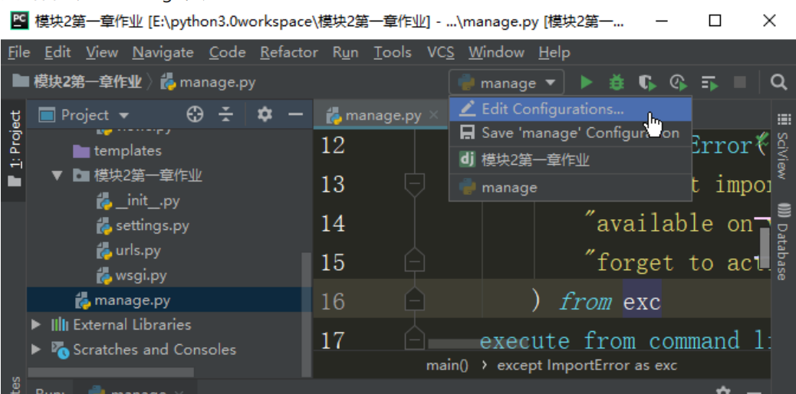

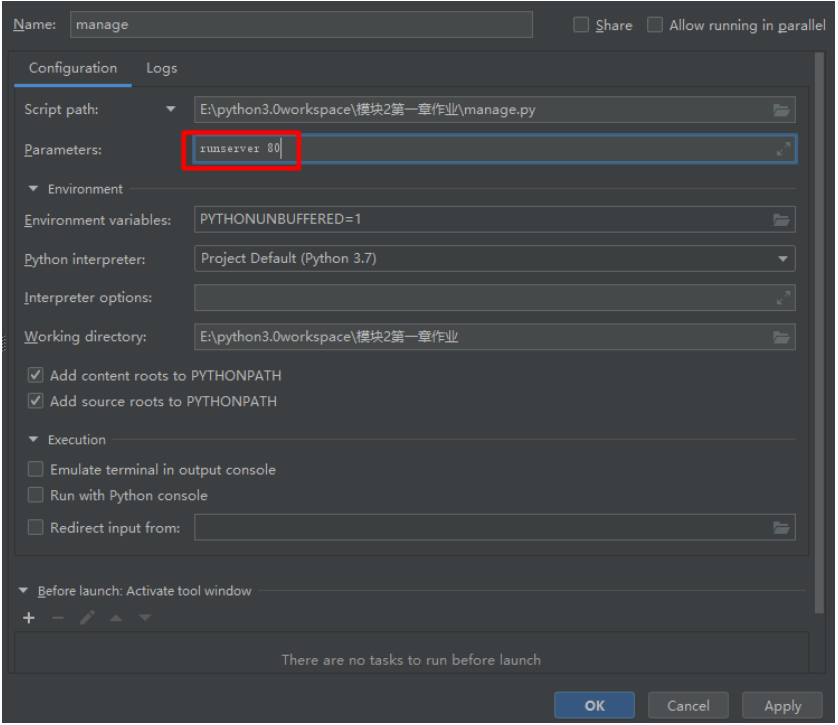

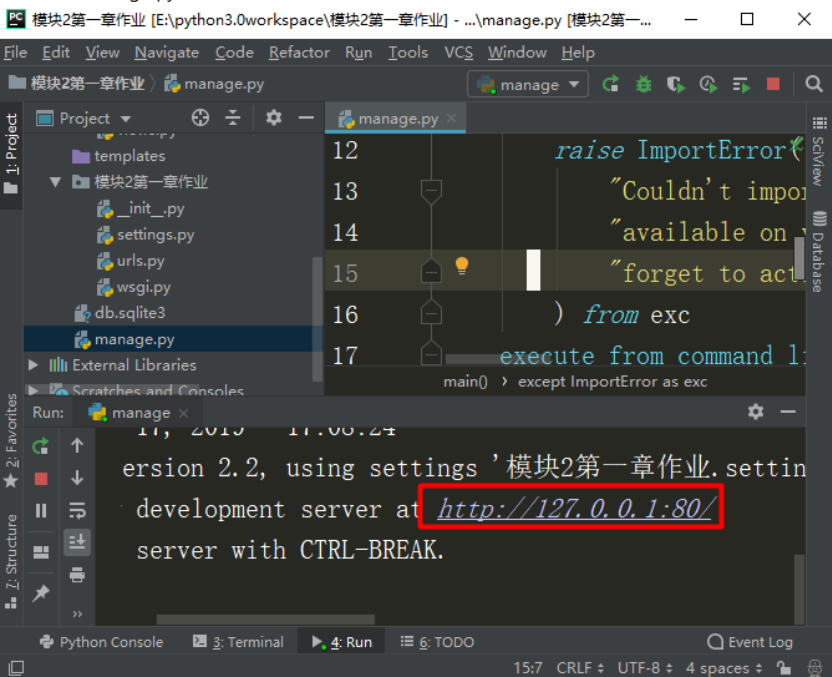

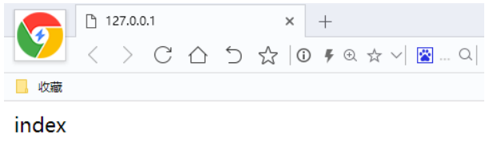

出现index，表示项目搭建没有问题

### 3 添加下载功能 

#### 3.1 思路分析 

* 让视图函数读取一个指定文件夹里面的文件名，把文件名渲染到模板HTML中，即可完成文件 的动态展现
* 模板文件中以a标签的方式，让href指向对应的文件，即可实现下载，只不过这个文件的存储地 址需要在static中，即通过静态访问 

#### 3.2 新建共享文件夹

* 在static文件夹中新建一个名为file的文件夹，并把测试的zip压缩包放在里面

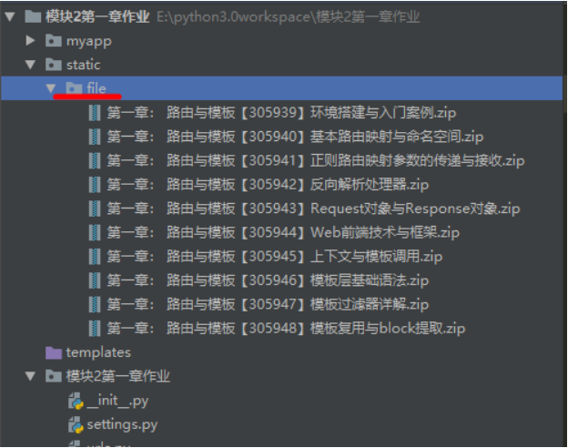

#### 3.3 视图函数

* 新建模板HTML

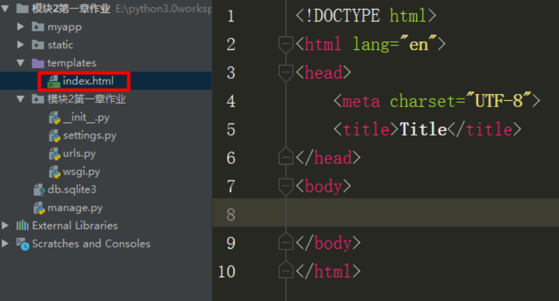

* 视图函数


```python
from django.shortcuts import render,HttpResponse
# 导入os
import os 

# Create your views here.
def index_handler(request):
    # 得到所有的文件名
    file_s = os.listdir(
        os.path.join('static','file')
    )
    return render(request,'index.html',context={'file_s':file_s})

```

* 渲染模板

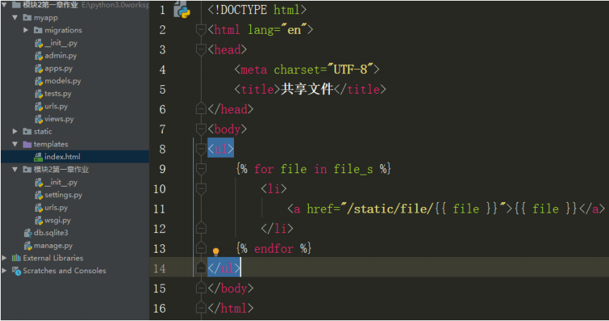

```python
<!DOCTYPE html> 
	<html lang="en"> 
<head> 
	<meta charset="UTF‐8">
	<title> 共享文件</title> 
</head> 
<body> 
	<ul> 
     
	<li> 
    <a href="/st atic/file/{{ file }}">{{ file }}</a> </li> 
	 
	</ul> 
</body>
</html>
```

**说明：遍历file_s，得到文件名file，href="/static/file/【文件名】"，得到静态地址**

* 测试一下首页

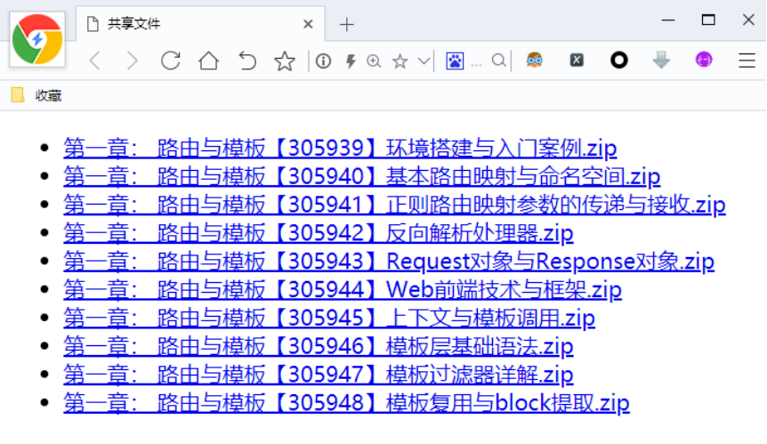

### 4 编辑前端样式 

注： ‐ 前端样式并不是课程的重点，这里只做了解 

#### 4.1 引入Bootstrap的css与js文件

```python
<link rel="stylesheet"
href="https://cdn.staticfile.org/twitter-bootstrap/3.3.7/css/bootstrap.min.css">
<script src="https://cdn.staticfile.org/jquery/2.1.1/jquery.min.js"></script>
<script src="https://cdn.staticfile.org/twitter-bootstrap/3.3.7/js/ bootstrap.min.js"></script>
```

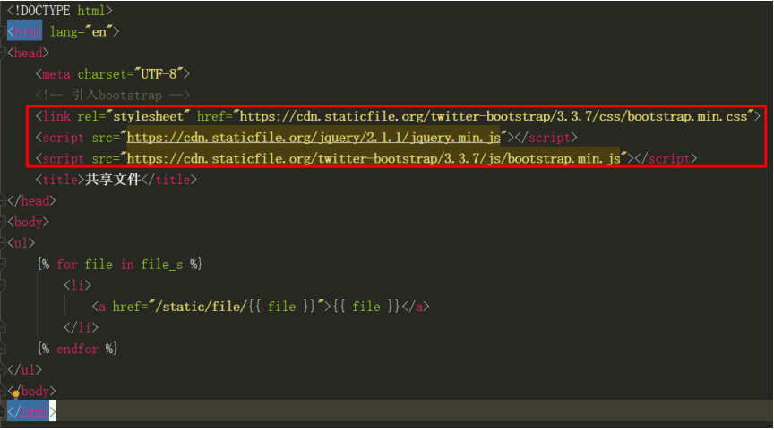

#### 4.2 设置class

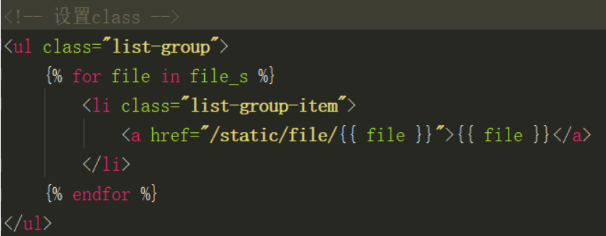

#### 4.3 再瞅一下首页

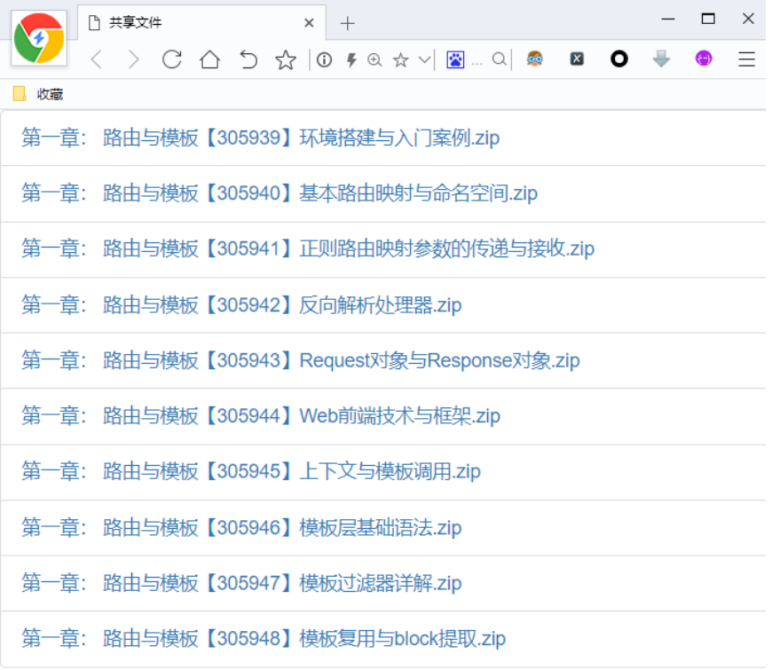

## 三、评分标准

* 完成路由与视图的配置         10分
* 完成模板层开发                     10分
* 代码注释，规范                     10分