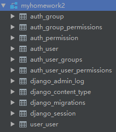
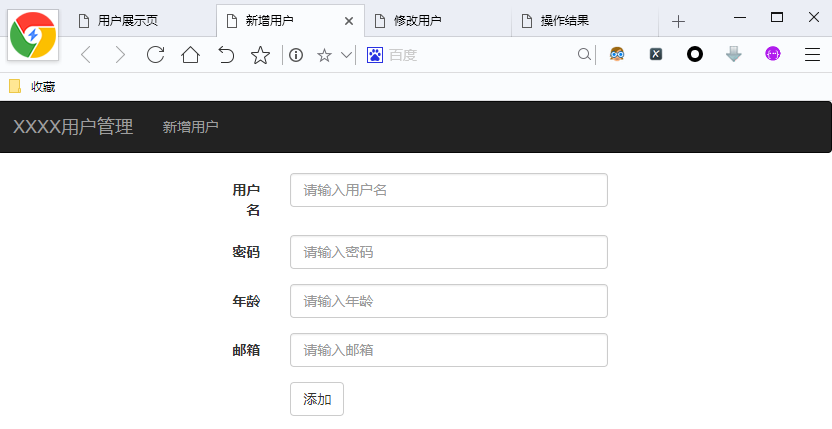
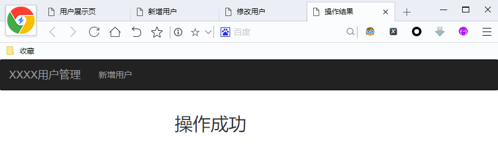
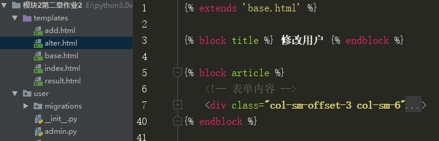
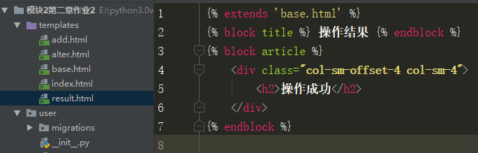

# 第三周作业3

## 1 项目说明

制作一个用户信息管理模型 用户信息包括： ‐ 姓名 ‐ 密码 ‐ 年龄 ‐ 邮箱 ‐ 创建时间
产品功能：1.全部用户信息的展示（查） 2.添加新用户（增） 3.修改用户信息（改） 4.删除用户（删）

项目展示： 首页显示所有的用户数据： 


新增用户： 


修改用户： 


删除用户： 


## 2 搭建项目

### 2 .1 创建 Django项目


### 2 .2 数据库设计

#### 2 .2 .1 数据库配置

通过Pycharm连接MySQL 数据库 


创建数据库，指明编码方式是utf8 


在settings中配置刚刚创建好的数据库 


#### 2 .2 .2 字段分析

根据项目要求，用户的信息包括：用户名、密码、年龄、邮箱、创建时间

| 字段含义 | 字段关键字     | 类型        | 约束            |
| -------- | -------------- | ----------- | --------------- |
| 用户名   | username       | varchar(16) | unique,not null |
| 密码     | password       | varchar(32) | not null        |
| 年龄     | age            | tinyint     | not null        |
| 邮箱     | email          | varchar(80) |                 |
| 创建时间 | createDatetime | datetime    | default= now()  |

#### 2 .2 .3 定义模型类


```python
from django.db import models
import datetime

# Create your models here.
class User(models.Model):
    username=models.CharField(max_length=16,unique=True)
    password = models.CharField(max_length=32)
    age = models.SmallIntegerField()
    email = models.CharField(max_length=80)
    createDatetime = models.DateTimeField(auto_now_add=datetime.datetime.now())
```

#### 2.3.4 数据迁移

##### 2.3.4.1 生成迁移文件

```python
python manage.py makemigrations
```


运行后，在User app的migrations文件夹中出现数据迁移文件 


##### 2.3.4.2 执行迁移文件

```python
python manage.py migrate
```


得到更新后的数据库 



### 2 .3 构建路由与视图

#### 2 .3 .1 路由分析

需要的页面有： ‐ 首页：展示所有用户数据 ‐ 添加新用户：表单实现数据的提交 ‐ 修改用户：根据I d对应被修改
的用户，表单数据实现提交 ‐ 删除用户：发送被删除用户的I d到服务器，完成删除 ‐ 操作结果：显示添加、修改
与删除操作是否成功
路由传参分析： ‐ 首页：展示所有的用户信息，不需要接受参数 ‐ 添加新用户：新增的用户数据由表单提交，不
需要路由传参 ‐ 修改用户：需要传递被修改用户的I d，I d由路由接收，修改的用户数据又表单提交 ‐ 删除用户：
由路由接受被删除的用户I d，后台完成删除操作

#### 2 .3 .2 user中的子路由定义

```python
from django.urls import path,re_path
from . import views
urlpatterns = [
    path('',views.index_handler,name='index'), # 数据展示 
    path('add',views.add_handler,name='add'), # 数据添加 
    re_path('alter/(\d+)',views.alter_handler,name='alter'), # 根据Id进行修改
    re_path('del/(\d+)',views.del_handler,name='del'), # 根据Id进行删除
]
```


#### 2 .3 .3 创建视图函数

```python
from django.shortcuts import render,HttpResponse

# Create your views here.
def index_handler(request):
    return HttpResponse('index')


def add_handler(request):
    return HttpResponse('add')


def alter_handler(request,id):
    return HttpResponse('alter')


def del_handler(request,id):
    return HttpResponse('del')
```


#### 2 .3 .4 主路由中包含子路由


### 2 .4 测试项目

运行manage.py，检查所有路由与视图是否正常运行 


## 3 把静态 HTML整理成模板

### 3 .1 迁移 HTML

找到作业资料中为大家准备的静态HTML文件 


 注：这个几个静态文件可以直接拖拽到浏览器中运行，打开后的结果如下： 首页： 


新增用户页： 



修改用户页： 


操作结果页： 



把这几个 HTML粘贴到templates模板文件夹中

### 3 .2 模板继承与代码块提取

#### 3 .2 .1 建立父模板
在templates文件夹中新建一个base.html，目的在于提取公共部分，其他的模板文件都继承base.html 


把index.html中的内容复制粘贴到base.html中

### 3 .2 .2 代码块抽离

抽离出两个代码块： 1.title 2.article（导航栏下面的主题部分） 


修改导航栏中的两个链接，通过反向解析路由，得到链接地址 


完整代码：

```python
<!DOCTYPE html>
<html lang="en">
<head>
    <meta charset="UTF-8">
    <title>
         
    </title>
    <link rel="stylesheet" href="https://cdn.staticfile.org/twitter-bootstrap/3.3.7/css/bootstrap.min.css">
    <script src="https://cdn.staticfile.org/jquery/2.1.1/jquery.min.js"></script>
    <script src="https://cdn.staticfile.org/twitter-bootstrap/3.3.7/js/bootstrap.min.js"></script>
    <style type="text/css">
        a {
            color: black;
        }
    </style>
</head>
<body>
<!-- 导航栏 -->
<nav class="navbar navbar-inverse" role="navigation">
    <div>
        <a class="navbar-brand" href="">XXXX用户管理</a>
    </div>
    <div>
        <ul class="nav navbar-nav">
            <li class=""><a href="">新增用户</a></li>
        </ul>
    </div>
</nav>
 
</body>
</html>
```

### 3 .3 index 继承base


完整代码：

```python
 
 首页  

    <!-- 数据展示 -->
    <div class="container"...>

```

### 3 .4 add继承base


 完整代码： 

```python

 新增用户 

    <!-- 表单内容 -->
    <div class="col-sm-offset-3 col-sm-6"...>

```

### 3 .5 alter 继承base



 完整代码： 

```python

 修改用户 

    <!-- 表单内容 -->
    <div class="col-sm-offset-3 col-sm-6"...>

```

### 3 .6 result 继承base



完整代码：

```python

 操作结果 

    <div class="col-sm-offset-4 col-sm-4">
        <h2>{{ message }}</h2>
    </div>

```

## 4 完善功能

### 4 .1 首页

#### 4 .1 .1 创建初始数据

因为首页是数据展示页，我们需要一些用户的数据，可以预先自己在user表中随意添加一些数据 例如，这里是我创建的10 个初始用户数据： 


#### 4 .1 .2 开发index _handler

思路： 1. 查找user表中所有的用户数据 2. 把这些数据渲染到index.html中

```python
from django.shortcuts import render,HttpResponse
from user.models import User

# Create your views here.
def index_handler(request):
    # 查找到所有的user对象
    users = User.objects.all()
    # 渲染模板，把users传递过去
    return render(request,'index.html',context={'users':users})
```


#### 4 .1 .3 开发index 模板

思路： ‐ 对传递过来的users数据进行遍历，每一个user对象为table中的一行


注： ‐ 日期要进行格式化输出 ‐ 在“ 操作 ” 列中，有两个链接，一个是修改，一个是删除，这两个链接需要对应Id，所以反向解析路由的时候传递每一行数据的 Id值

完整代码： 

```python

 首页 

    <!-- 数据展示 -->
    <div class="container">
        <table class="table table-hover">
            <!-- 表头 -->
            <thead>
            <tr>
                <th>id</th>
                <th>用户名</th>
                <th>密码</th>
                <th>年龄</th>
                <th>邮箱</th>
                <th>创建时间</th>
                <th>操作</th>
            </tr>
            </thead>
            <!-- 表内容 -->
            <tbody>
            
                <tr>
                    <td>{{ user.id }}</td>
                    <td>{{ user.username }}</td>
                    <td>{{ user.password }}</td>
                    <td>{{ user.age }}</td>
                    <td>{{ user.email }}</td>
                    <td>{{ user.createDatetime|date:'Y-m-d H:i:s' }}</td>
                    <td>
                        <a href="">修改</a>
                        <a href="">删除</a>
                    </td>
                </tr>
            
            </tbody>
        </table>
    </div>

```

#### 4 .1 .4 测试首页


### 4 .2 新增用户

#### 4 .2 .1 开发add_handler

思路： ‐ 得到用户提交的表单数据 ‐ 把表单数据写入数据库
会遇到的问题： ‐ 包含用户密码的数据，应该采用Post方式提交，如何接收？ ‐ 对于不同的请求方式应该如何处理

Post请求的提交与接收 1. 在前端的Form中需要加入 2. 在后端中，通过username = request.POST.get('username')，得到表单提交的数据 

对于不同的请求： 1. Get请求，返回渲染好的add.html模板 2. Post请求，处理提交的新增用户表单数据，写入数 据库


由于写入数据可能出现异常，所以使用try和except，对于Post请求提交的表单数据处理，不管是否出现出现异常，都返回渲染后的操作结果页面，但传递不同的message，在result.py中显示message，即操作的结果描述

完整代码：

```python
def add_handler(request):
    # 如果是GET请求，返回渲染好的新增用户页面
    if request.method == 'GET':
        return render(request,'add.html')
    # 如果是POST请求，处理表单数据，写入数据库，返回操作结果
    else:
        # 得到用户名、密码、年龄、邮箱
        username = request.POST.get('username')
        password = request.POST.get('password')
        age = request.POST.get('age')
        email = request.POST.get('email')
        try:
            # 保存数据
            User(username=username,password=password,age=age,email=email).save()
            # 如果保存成功，返回操作结果页面，显示message
            return render(request,'result.html',{'message':'新增用户成功'})
        except:
            # 如果保存失败，返回操作结果页面，显示message
            return render(request,'result.html',{'message':'新增用户失败'})

```

#### 4 .2 .2 开发add模板

1. 添加Form表单的地址action与请求方式method 

2. 对于Form表单提交的Post请求数据，需要加入


完整代码：

```python


 新增用户 


    <!-- 表单内容 -->
    <div class="col-sm-offset-3 col-sm-6">
        {# 1.填写Form表单的提交地址action与请求方式method   #}
        <form class="form-horizontal" role="form" action="" method="post">
            {# 2.加入csrf_token           #}
            
            <div class="form-group">
                <label for="username" class="col-sm-2 control-label">用户名</label>
                <div class="col-sm-10">
                    <input type="text" class="form-control" id="username" placeholder="请输入用户名" name="username">
                </div>
            </div>
            <div class="form-group">
                <label for="password" class="col-sm-2 control-label">密码</label>
                <div class="col-sm-10">
                    <input type="text" class="form-control" id="password" placeholder="请输入密码" name="password">
                </div>
            </div>
            <div class="form-group">
                <label for="age" class="col-sm-2 control-label">年龄</label>
                <div class="col-sm-10">
                    <input type="text" class="form-control" id="age" placeholder="请输入年龄" name="age">
                </div>
            </div>
            <div class="form-group">
                <label for="email" class="col-sm-2 control-label">邮箱</label>
                <div class="col-sm-10">
                    <input type="text" class="form-control" id="email" placeholder="请输入邮箱" name="email">
                </div>
            </div>
            <div class="form-group">
                <div class="col-sm-offset-2 col-sm-10">
                    <button type="submit" class="btn btn-default">添加</button>
                </div>
            </div>
        </form>
    </div>

```

#### 4 .2 .3 开发result模板

显示传递过来的message


完整代码：

```python

 操作结果 

    <div class="col-sm-offset-4 col-sm-4">
        <h2>{{ message }}</h2>
    </div>

```

#### 4 .2 .4 测试添加用户


  


### 4 .3 修改用户

#### 4 .3 .1 开发alter_handler

思路： ‐ 如果是G et请求： ‐ 返回修改用户页面，并做到数据填充（即不是空的表单对象，方便用户修改） ‐ 如果是Post请求 ‐ 根据路由中传递的Id，锁定要修改的用户对象 ‐ 得到表单提交的数据，完成修改 ‐ 返回操作结果


完整代码：

  ```python
def alter_handler(request,id):
    # 得到被修改的user对象
    user = User.objects.get(id=id)
    # 如果是GET请求，渲染页面
    if request.method == 'GET':
        return render(request,'alter.html',context={'user':user})
    # 如果是POST请求，处理数据
    else:
        # 得到用户名、密码、年龄、邮箱
        user.username = request.POST.get('username')
        user.password = request.POST.get('password')
        user.age = request.POST.get('age')
        user.email = request.POST.get('email')
        # 如果修改成功
        try:
            user.save()
            return render(request,'result.html',context={'message':'修改用户成功'})
        # 如果修改不成功
        except:
            return render(request,'result.html',context={'message':'修改用户失败'})
  ```

#### 4 .3 .2 开发alter模板


这里填充默认值，为了方便用户操作 

完整代码：

```python

 修改用户 

    <!-- 表单内容 -->
    <div class="col-sm-offset-3 col-sm-6">
        {# 1.修改action与method   #}
        <form class="form-horizontal" role="form" action="" method="post">
            {# 2.加入csrf_token，执行Post请求           #}
            
            <div class="form-group">
                <label for="username" class="col-sm-2 control-label">用户名</label>
                <div class="col-sm-10">
                    <input type="text" class="form-control" id="username" placeholder="请输入用户名" name="username" value="{{ user.username }}">
                </div>
            </div>
            <div class="form-group">
                <label for="password" class="col-sm-2 control-label">密码</label>
                <div class="col-sm-10">
                    <input type="text" class="form-control" id="password" placeholder="请输入密码" name="password" value="{{ user.password }}">
                </div>
            </div>
            <div class="form-group">
                <label for="age" class="col-sm-2 control-label">年龄</label>
                <div class="col-sm-10">
                    <input type="text" class="form-control" id="age" placeholder="请输入年龄" name="age" value="{{ user.age }}">
                </div>
            </div>
            <div class="form-group">
                <label for="email" class="col-sm-2 control-label">邮箱</label>
                <div class="col-sm-10">
                    <input type="text" class="form-control" id="email" placeholder="请输入邮箱" name="email" value="{{ user.email }}">
                </div>
            </div>
            <div class="form-group">
                <div class="col-sm-offset-2 col-sm-10">
                    <button type="submit" class="btn btn-default">修改</button>
                </div>
            </div>
        </form>
    </div>

```

#### 4 .3 .3 测试修改用户


### 4 .4 删除用户

#### 4 .4 .1 开发del _handler


完整代码： 

```python
def del_handler(request,id):
    # 如果删除成功
    try:
        User.objects.get(id=id).delete()
        return render(request,'result.html',context={'message':'删除用户成功'})
    # 如果删除失败
    except:
        return render(request,'result.html',context={'message':'删除用户失败'})
```

#### 4 .4 .2 测试删除用户


## 5 评分标准

1. 构造模型层并生成对应的表结构     10分
2. 完成增删改查功能的开发                 20分
3. 代码注释，规范                                 10分

