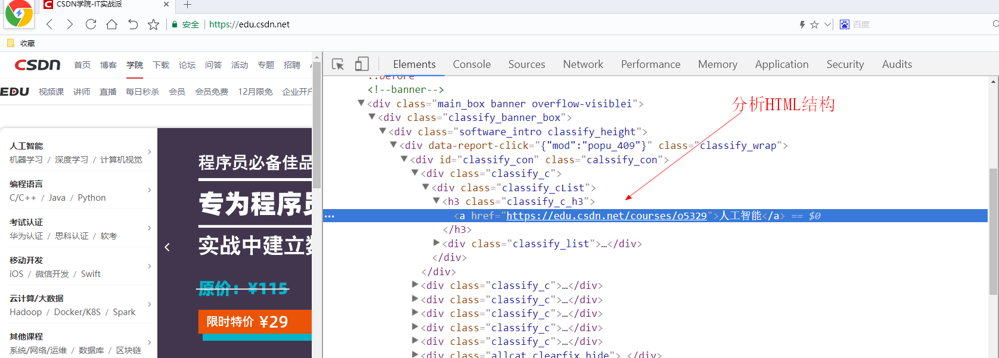
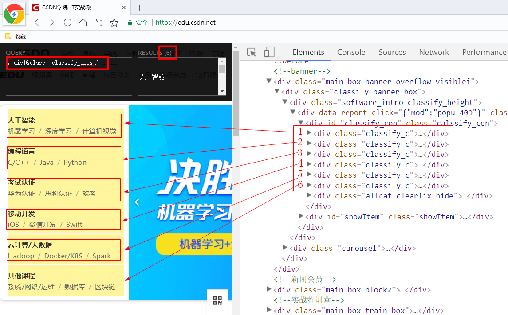
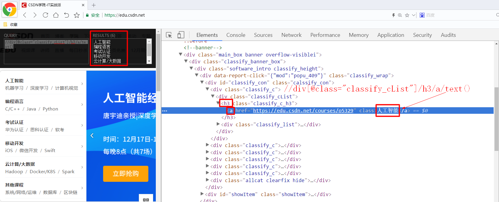
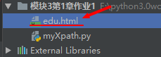

# 第五周作业1

## 1 作业描述

提取CSDN学院首页中的课程分类（https: //edu.csdn.net/） 


注：本章第5 节Python中的lxml模块有作业的讲解

## 2 动手开始

### 2 .1 分析X path语句




```python
//div[@class="classify_cList"]
```



提取1级分类

```python
cmd //div[@class="classify_cList"]/h3/a/text()
```



提取2级分类

```python
cmd //div[@class="classify_cList"]/div/span/a/text()
```


### 2 .2 代码实现

读取本地的edu.html，对其做数据提取 



```python
import lxml.etree as le

with open('edu.html','r',encoding='utf-8') as f:
    # 读取本地的edu.html
    html = f.read()
    # 把html转成XML对象
    html_x = le.HTML(html)
    # 得到6个div对象
    div_x_s = html_x.xpath('//div[@class="classify_cList"]')
    # 构造数据储存对象
    data_s = []
    # 对6个包含1级分类和2级分类对象做遍历
    for div_x in div_x_s:
        # 得到1级分类
        category1 = div_x.xpath('./h3/a/text()')[0]
        # 得到这个1级分类下的所有2级分类
        category2_s = div_x.xpath('./div/span/a/text()')
        data_s.append(
            dict(
                category1 = category1,
                category2_s = category2_s
            )
        )
    # 打印data_s
    print(data_s)
    # 对data_s进行遍历打印
    for data in data_s:
        print(data.get('category1'))
        for category2 in data.get('category2_s'):
            print('   ',category2)
```

### 2 .3 解题提示

对上个Xpath的结果在行进Xpath数据提取，需要加“ .” 例如：

 ```python
div_x_s = html_x.xpath('//div[@class="classify_cList"]') 
for div_x in div_x_s:
    category1 = div_x.xpath('./h3/a/text()')[0]
 ```

## 3 评分标准

1. 写出正确的XPath语句10分

2. 成功输出课程分类10分

3. 代码注释，规范10分

 

 