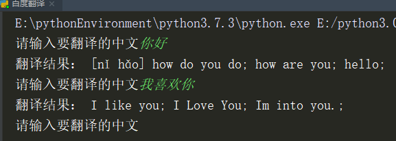
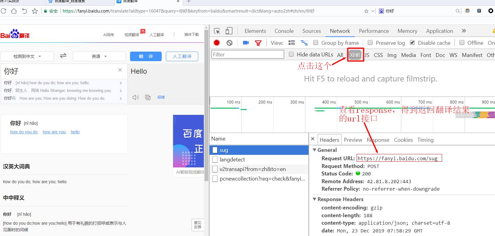
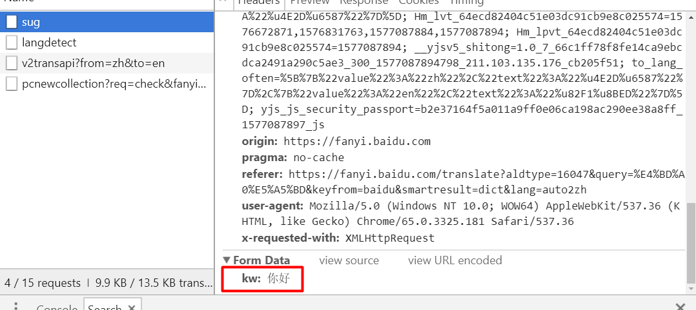
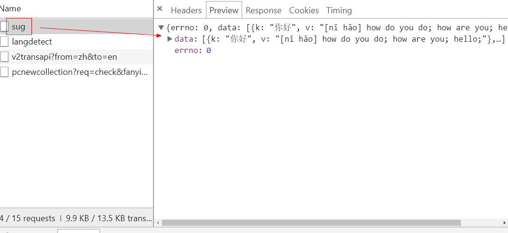

# 第五周作业2

## 1 作业描述

制作一个中译英的翻译小工具 



## 2 动手开始

### 2.1 分析百度翻译接口





注：如果使用谷歌浏览器，需要在输入框多加一个空格才会显示sug接口

接口地址：https://fanyi.baidu.com/sug 请求方式：Post 表单数据：kw：你好 返回结果数据类型：



 ```python
{
    'errno': 0,
    'data': [
        {'k': '你好', 'v': '[nǐ hǎo] how do you do; how are you; hello;'},
        {'k': '你好，陌生人', 'v': '网络 Hello Stranger; knowing me knowi ng you;'},
        {'k': '你好吗', 'v': 'How are you; How are you doing; How do you do;'}
    ]
}
 ```

所以在返回的data列表中的第1项，v键的值，是“你好”的翻译结果 

### 2.2 代码实现

```python
import urllib.request as ur
import urllib.parse as up
import json

while True:
    # 得到用户输入的中文
    word = input('请输入要翻译的中文')
    # 将数据进行url编码
    data = { 'kw':word }

    data_url = up.urlencode(data)
    # 构造request对象，添加访问的url接口与请求数据
    request = ur.Request(
        url='https://fanyi.baidu.com/sug',
        data=data_url.encode('utf‐8'),
    )
    # 得到返回的response对象
    response = ur.urlopen(request).read()
    # 将Json字符串转换成Python的字典
    ret = json.loads(response)
    # 得到翻译结果
    translate = ret['data'][0]['v']
    # 打印翻译的结果
    print('翻译结果：',translate)
```

### 2.3 解题提示

1. ur.urlRequest对象中，如果有data，则默认以Post的方式提交请求 

2. ur.urlRequest对象中传递的data参数，需经过url编码，再转成字节，即encode('utf‐8')

3. json.loads()可以把Json字符串转换成Python对象，json.dumps()可以把Python对象转换成Json字符串 

## 3 评分标准

1. 找到翻译的HTTP接口规则 10分

2. 得到服务器响应回来的结果数据，并做好处理，得到翻译的结果 10分

3. 代码注释，规范10分

 

 