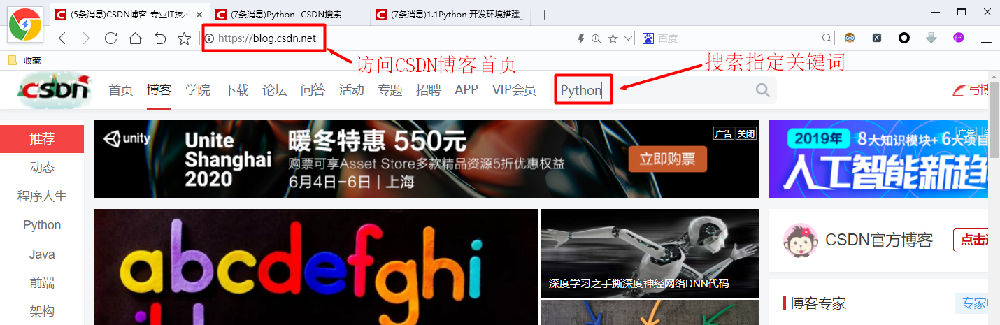
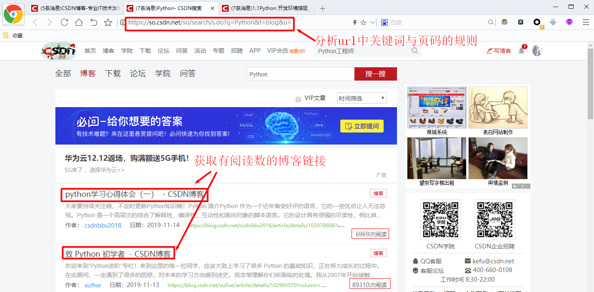
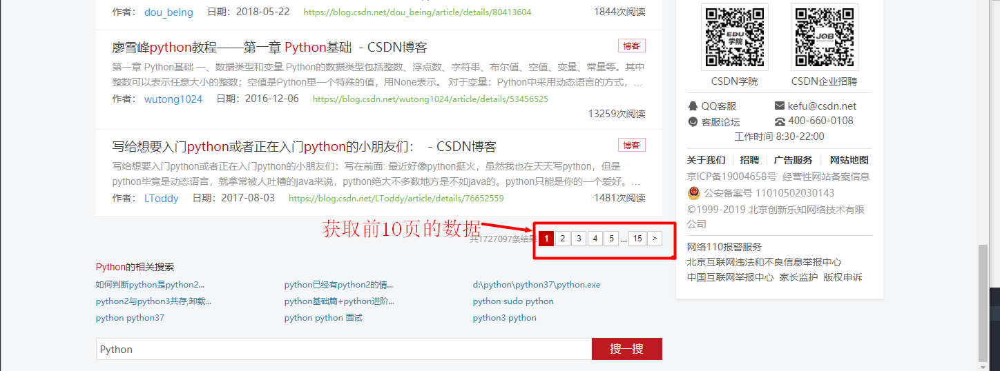
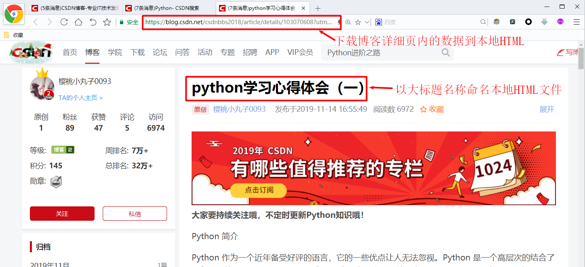
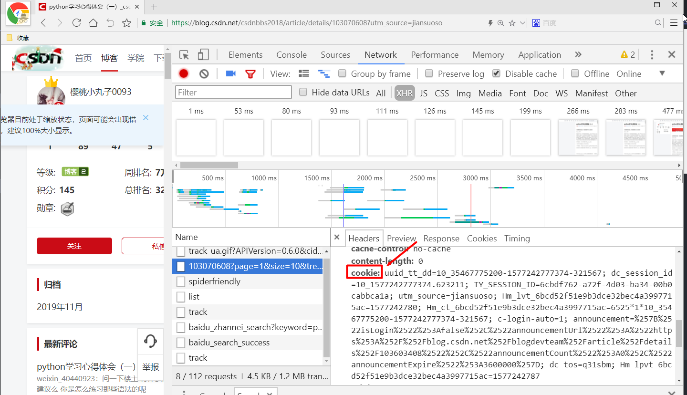

# 第五周作业3

## 1 作业描述

在CSDN 站内搜索技术关键词，例如P ython，下载前10页热门文章HTML源码到本地，文件命名方式与博客大标题保持一致

## 2 解题提示

### 2 .1 分析ur l

分析请求地址规则的时候，一般第一页没有代表性，习惯性直接去分析第二页的url 比如在CSDN博客首页上所有Python关键字 第一页展示页的url地址是： ‐ https://so.csdn.net/so/search/s.do?q=Python&t=blog&u= 第二页展示页的url地址是： ‐ https://so.csdn.net/so/search/s.do?p=2&q=Python&t=blog&viparticle=&domain=&o=&s=&u=&l=&f=&rbg=0 经过多个页面地址的分析，我们不难得出p是页码，q是关键词 

### 2 .2阿里反爬

由于CSDN博客的详细页引入了阿里的反爬，所以我们需要手动为headers加入C ookie Cookie可以从浏览器中复制粘贴得到

### 2 .3 关于解码

Python对于一些字符的编码和解码能力不是特别的好，比如在博客中有一些特殊字符（如表情 符）,这些字符在浏览器中可以正常显示，但Python解释器可能会在解码的时候报错 那么我们如何 忽略掉特殊字符呢？ 【字符串对象】= 【字节对象】.decode﴾'utf‐8','ignore'﴿ ignore可以帮助我们忽略掉utf‐8无法解码的字节 

## 3 评分标准

1. 本题共计40分 

2. 破解URL规则，通过Xpath得到链接地址与博客标题20分 

3. 完成博客下载 10分 

4. 代码注释，规范10分