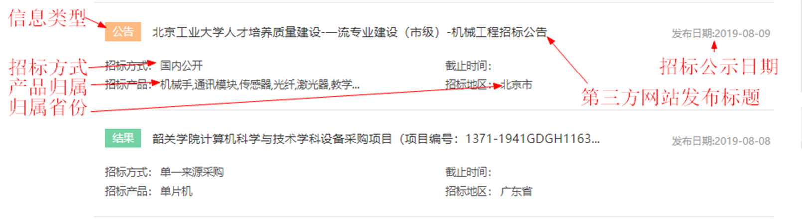

# 第六周作业2

## 1 作业描述 

使用Scrapy框架，完成必联网招标信息采集 

采集字段：

| **关键字**       | **说明**                     |
| ---------------- | ---------------------------- |
| projectcode      | 项目编号                     |
| web              | 信息来源网站（例如：必联网） |
| keyword          | 关键字                       |
| detail_url       | 招标详细页网址               |
| title            | 第三方网站发布标题           |
| toptype          | 信息类型                     |
| province         | 归属省份                     |
| product          | 产品范畴                     |
| industry         | 归属行业                     |
| tendering_manner | 招标方式                     |
| publicity_date   | 招标公示日期                 |
| expiry_date      | 招标截止时间                 |

一级页面中：

二级页面中： 

## 2 解题提示 

1. 必联网有些页面需要登录才可以得到响应，需要手动登录，并得到浏览器中的Cookie值，把Cookie加入到请求头中 

2. 关于数据的提取，有些需要定制正则表达式，比如项目编号可能在详细页的文本中，用普通的XPath无法提取出来，这个需要多看几个页面，多做测试，分析数据格式 

3. 数据的持久化可以在管道文件中进行，以课程中讲解的为例，把招标信息保存到MySQL数据库中

4. 代理IP应该在下载中间件中进行设置，代理IP需要访问第三方的接口，具体参照录播中的步骤讲解 

## 3 评分标准

1. 爬虫可以对必联网的招标数据进行采集 20分 

2. 数据提取的准确性，例如可以更有效的提取出招标编号 10分 

3. 代码注释，规范10分