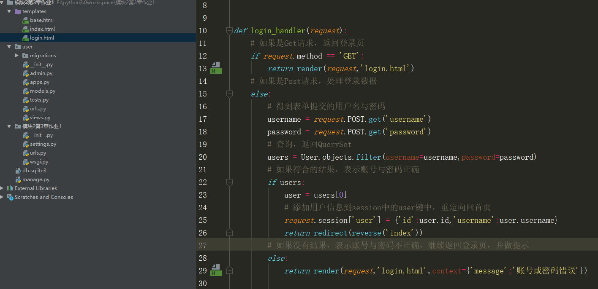

# 第四周作业1

## 1 作业描述

 完成用户登录与登录状态显示 

需求： 1. 首页 1. 未登录状态，显示登录按钮 2. 已登录的用户，显示"你好用户名" 2. 登录页 1. 账 

号与密码正确，跳转到首页 2. 账号与密码不正确，在登录页面上提示“账号和密码错误” 

注：项目展示在3.4测试小节 

## 2 搭建项目 

### 2 .1 创建项目与App


### 2 .2 数据库与模型类

#### 2 .2 .1 创建数据库

 

#### 2 .2 .2 配置Settings

 

#### 2 .2 .3 定义模型类

 

#### 2 .2 .4 生成并执行迁移文件

 

### 2 .3 搞定路由

#### 2 .3 .1 子路由

配置首页路由与登录路由 

 

#### 2 .3 .2 总路由

 

### 2 .4 视图函数

 

### 2 .5 测试一下

 

保证前面的代码没问题，再开始下一步的开发 

## 3 逐一实现功能

### 3 .1 从静态文件到模板

#### 3 .1 .1 模板抽离

把资料中的静态页面复制到templates文件夹里面 

 

 建立base.html 


 把index.html的内容粘贴到base.html中 建立代码块： ‐ title ‐ article

 


#### 3 .1 .2 index.html继承base.html

 

#### 3 .1 .3 login.html继承base.html

 

### 3 .2 完成登录

#### 3 .2 .1 构建初始化用户数据

因为要登录，先往user表中插入些初始数据 


注： ‐ 单独运行文件manage.py ‐ 别忘了运行完manage.py以后，把加入的代码注释掉

#### 3 .2 .2 编写login_handler

对于不同的请求方式的处理： ‐ G et请求：返回登录页面 ‐ Post请求：处理数据 ‐ 如果账号密码正确，跳转首页 ‐ 如果账号密码不正确，仍返回登录页面，但提示“ 账号或密码错误”



login_handler的代码：

```python
def login_handler(request):
    # 如果是Get请求，返回登录页
    if request.method == 'GET':
        return render(request,'login.html')
    # 如果是Post请求，处理登录数据
    else:
        # 得到表单提交的用户名与密码
        username = request.POST.get('username')
        password = request.POST.get('password')
        # 查询，返回QuerySet
        users = User.objects.filter(username=username,password=password)
        # 如果符合的结果，表示账号与密码正确
        if users:
            user = users[0]
            # 添加用户信息到session中的user键中，重定向回首页
            request.session['user'] = {'id':user.id,'username':user.username}
            return redirect(reverse('index'))
        # 如果没有结果，表示账号与密码不正确，继续返回登录页，并做提示
        else:
            return render(request,'login.html',context={'message':'账号或密码错误'})
```

#### 3 .2 .3 登录页模板

如果返回了message，在表单前面输出提示内容 


### 3 .3 首页开发

#### 3 .3 .1 编写index_handler

 

 index_handler的代码：

```python
from django.shortcuts import render,HttpResponse,redirect,reverse
from user.models import User

# Create your views here.
def index_handler(request):
    # 判断session中是否有user
    if 'user' in request.session.keys():
        user = request.session['user']
        context = {'login_user':user}
    else:
        context = {}
    print(context)
    return render(request,'index.html',context=context)
```

#### 3 .3 .2 首页模板

因为首页中的导航栏继承于base.html，即修改base.html中的nav 

 

### 3 .4 测试

未登录状态访问首页 

 

点击登录 

 


## 4 拓展内容

可以在上面代码的基础上加入注销功能，即删除Session中的login_user

## 5 评分标准

1. 用户登录后，可以保持登录状态                                             10分

2. 登录过程中，账号或密码错误，可以在登录页面输出提示 10分

3. 代码注释，规范                                                                         10分


 

 