# 第四周作业2

## 1 作业描述

完整CSDN微课商城后台管理开发

### 1 .1 模型类开发

#### 1 .1 .1 表内字段与关系

 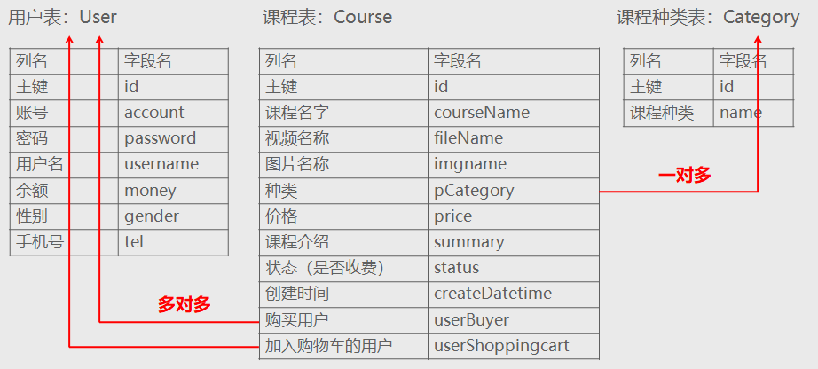

#### 1 .1 .2 用户表User

```python
from django.db import models

# Create your models here.
class User(models.Model):
    class Meta():
        verbose_name = verbose_name_plural = '用户表'
    account = models.CharField(max_length=16,unique=True,verbose_name='账号')
    password = models.CharField(max_length=16,verbose_name='密码')
    username = models.CharField(max_length=16,verbose_name='用户名',blank=True)
    money = models.DecimalField(max_digits=12,decimal_places=2,default=0,verbose_name='余额')	# 总位数12，小数位2
    gender = models.PositiveSmallIntegerField(default=0,verbose_name='性别',choices=((0,'男'),(1,'女')))						# 0：男，1：女，默认0
    tel = models.CharField(max_length=11,default='',verbose_name='手机号',blank=True)

    def __str__(self):
        return self.account

```

#### 1 .1 .3 课程种类表 C ategory

 ```python
class Category(models.Model):
    class Meta():
        # 定义表在后台管理中显示的名称
        verbose_name = verbose_name_plural = '课程种类表'
    name = models.CharField(max_length=50, unique=True, verbose_name='课程种类')

    def __str__(self):
        return self.name
 ```

#### 1 .1 .4 课程表Course

```python
from django.db import models
import datetime
from user.models import User
import os
# Create your models here.

def save_file(instance,filename):
    # 返回文件的保存路径，并把这个路径写入数据库中对应的字段中
    return os.path.join('video',filename)

def save_img(instance,filename):
    # 返回文件的保存路径，并把这个路径写入数据库中对应的字段中
    return os.path.join('static','img',filename)

class Course(models.Model):
    # Django中推荐CHOICES大写
    STATUS_CHOICES = (
        (0,'收费'),   # 元组中第一个参数存储在数据库中，第二个参数展现给用户
        (1,'免费'),
    )
    class Meta():
        # 定义表在后台管理中显示的名称
        verbose_name = verbose_name_plural = '课程表'

    courseName = models.CharField(max_length=40,verbose_name='课程名称')
    # FileField类型，可以在Admin后台管理中支持文件上传
    # upload_to定义上传文件的保存方法
    fileName = models.FileField(upload_to=save_file,verbose_name='文件名称')
    # ImageField类型，Admin后台管理支持图片的上传
    # upload_to定义上传文件的保存方法
    imgname = models.ImageField(upload_to=save_img,verbose_name='课程图片')
    # ForeignKey，课程的种类，引用Category表
    # 参数：
    #   to：外键引用的表，会自动定位到表中的主键
    #   related_name：表示反向查找，从category查找course，查找某一课程种类包括的具体课程对象
    #   on_delete=models.CASCADE：级联操作，删除种类的话，这种类中对应的课程也会被删除
    pCategory = models.ForeignKey(to=Category,related_name='courses_set',on_delete=models.CASCADE,verbose_name='课程类别')
    # DecimalField类型
    # 参数：
    #   max_digits：最大长度
    #   decimal_places：小数位
    price = models.DecimalField(max_digits=7,decimal_places=2,default=0,verbose_name='售价',blank=True)
    summary = models.CharField(max_length=1000,default='',verbose_name='课程介绍',blank=True)
    status = models.PositiveSmallIntegerField(default=0,verbose_name='状态',blank=True,choices=STATUS_CHOICES)						# 0：收费 1：免费，默认0
    # 创建的时间默认为当前的时间
    createDatetime = models.DateTimeField(default=datetime.datetime.now(),verbose_name='创建时间',blank=True)
    # ManyToManyField，多对多定义
    userBuyer = models.ManyToManyField(to=User,related_name='userBuyer_set',verbose_name='购买用户',blank=True)
    # ManyToManyField，多对多定义
    userShoppingcart = models.ManyToManyField(to=User,related_name='userShoppingcart_set',verbose_name='加入购物车的用户',blank=True)
```

### 1 .2 A dmin配置

#### 1 .2 .1 管理User A pp

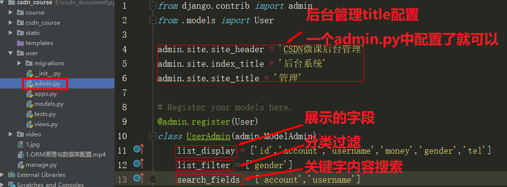

#### 1 .2 .2 管理 C ourse A pp

 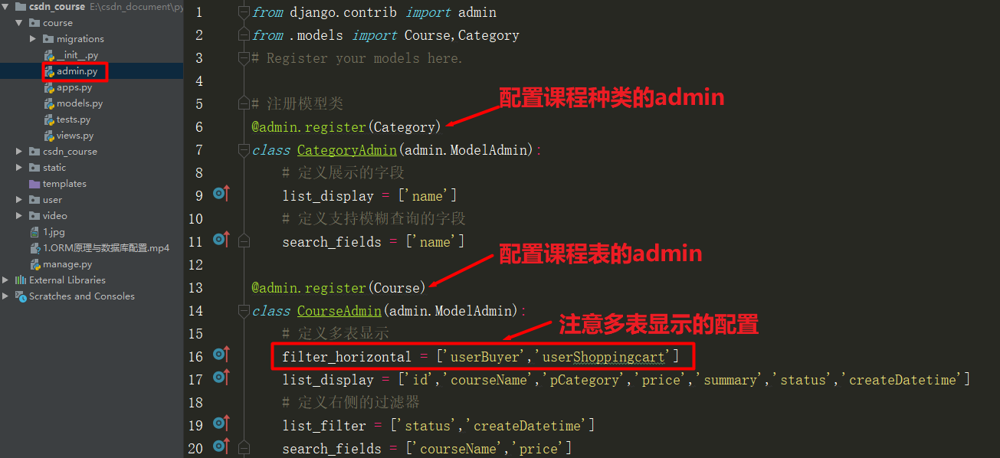

## 2 解题提示

### 2 .1 超级管理员的创建

```python
python manage.py createsuperuser
```

### 2 .2 文件上传

```python
def save_file(instance,filename):
    # 返回文件的保存路径，并把这个路径写入数据库中对应的字段中
    return os.path.join('video',filename)

# 省略其他代码
class Course(models.Model):
    fileName = models.FileField(upload_to=save_file,verbose_name='文件名称')
```

1. upload_to指向的是方法的地址，不要加括号 

2. save_file方法中接受两个参数，instance与filename，其中filename是用户上传文件的文件原 名，第一个参数instance一般不使用 

3. save_file方法返回的字符串结果，是用户上传文件的存储路径 

### 2 .3 关于显示名称

在Django的Admin中，显示App、模型类与字段等的名字，都使用verbose*name* 例如： *‐ App*的名称显示： 

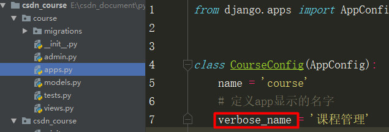

*‐* 模型 类的名称显示 

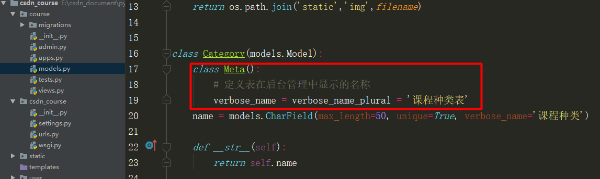

*‐* 这里加入verbose_name_plural是为了防止默认的复数，即出现“课程种类表s”情况的发生 

‐ 字段名称的显示 

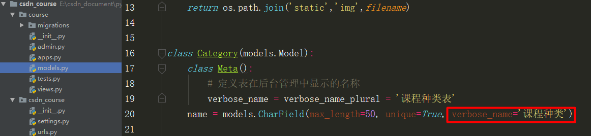

## 3 项目展示

### 3 .1 后台管理登录

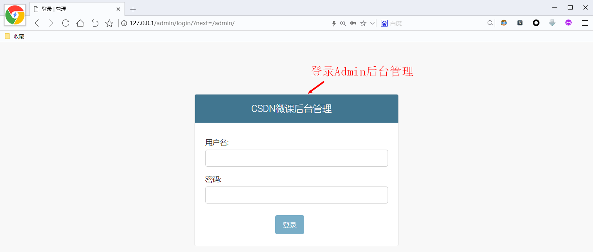

### 3 .2 后台管理首页

 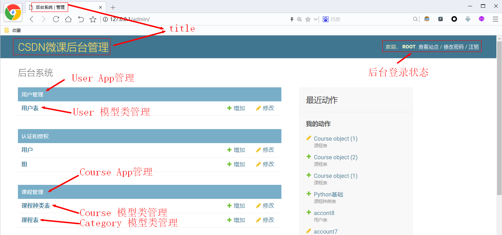

### 3 .3 用户数据展示页

 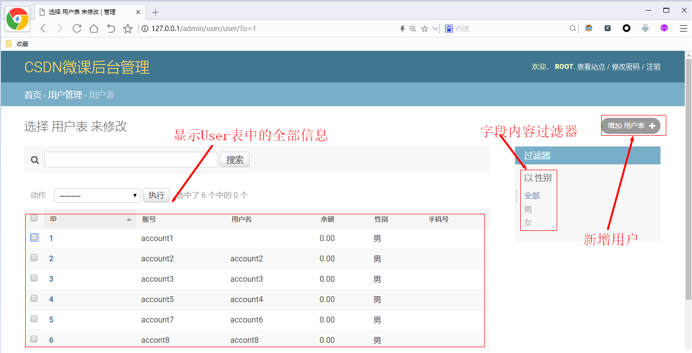

### 3 .4 新增用户页面

 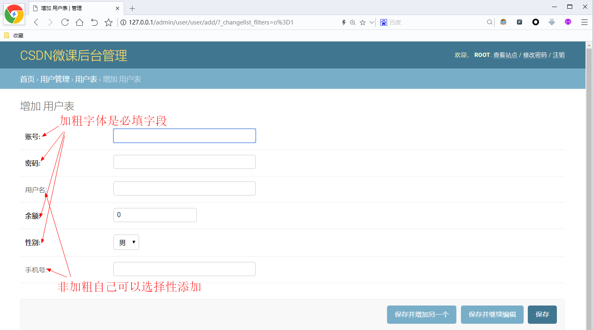

### 3 .5 课程种类展示页

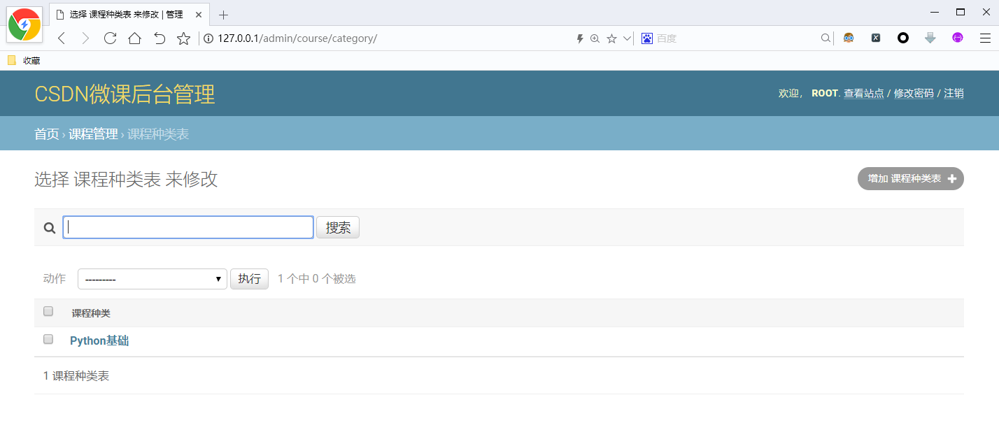

### 3 .6 课程展示页

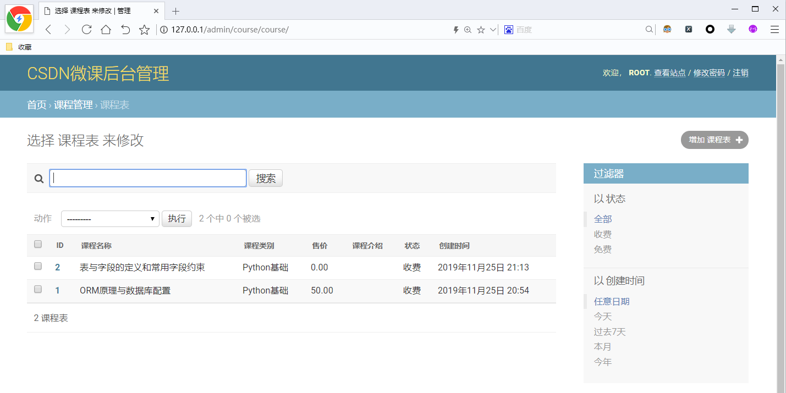

### 3 .7 新增课程页

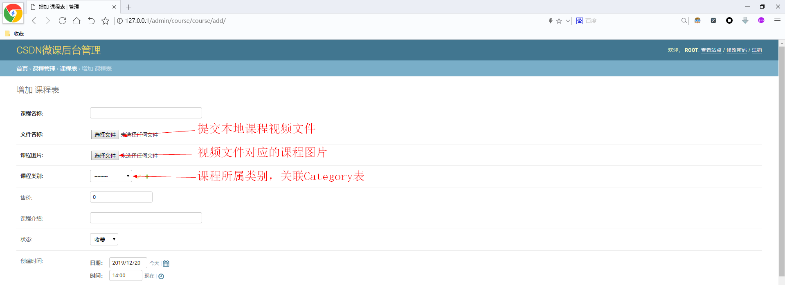

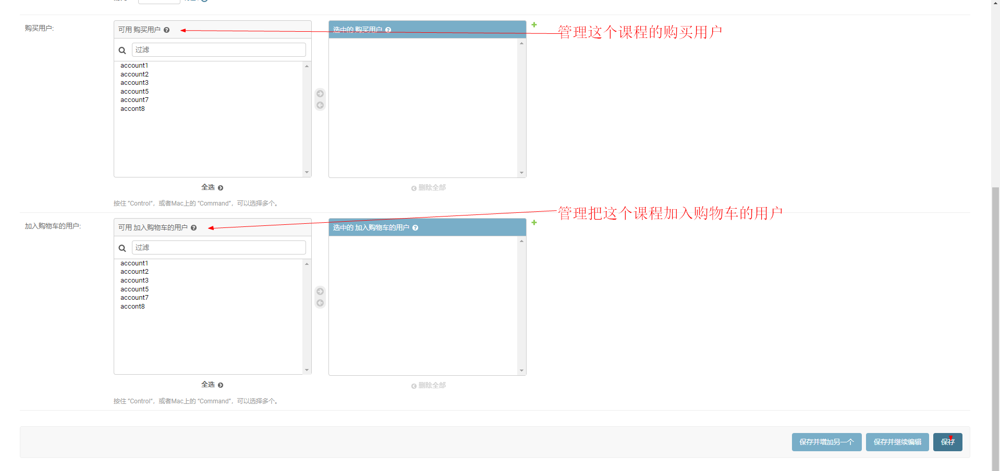

## 4 评分标准

1. 完成C SD N微课商城的模型层开发    10分
2. 完成Admin 后台管理配置                    10分
3. 代码注释，规范                                     10分

 