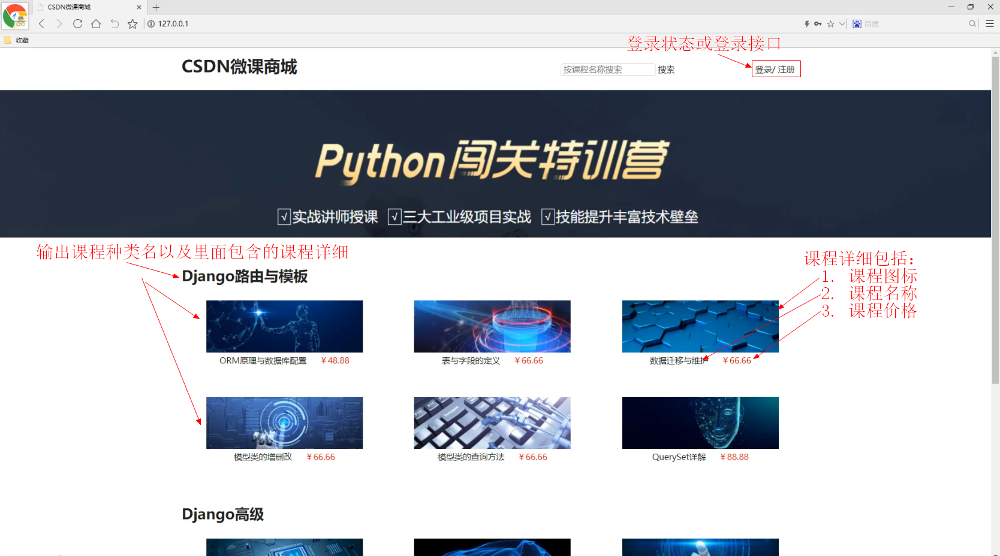
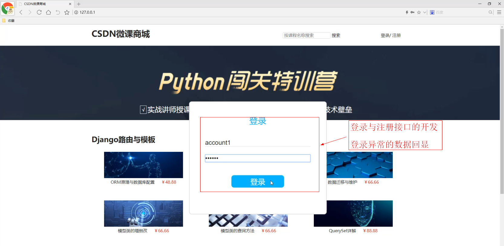
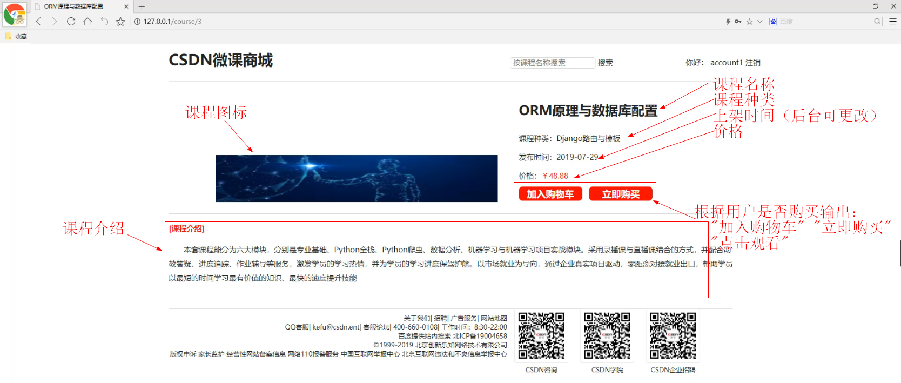
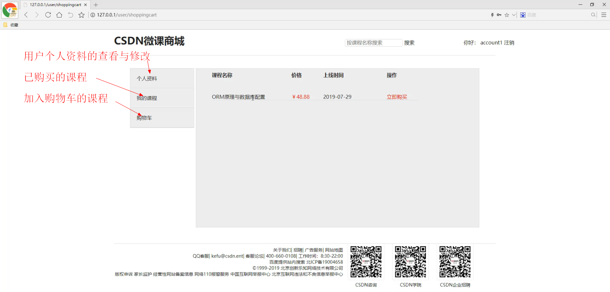
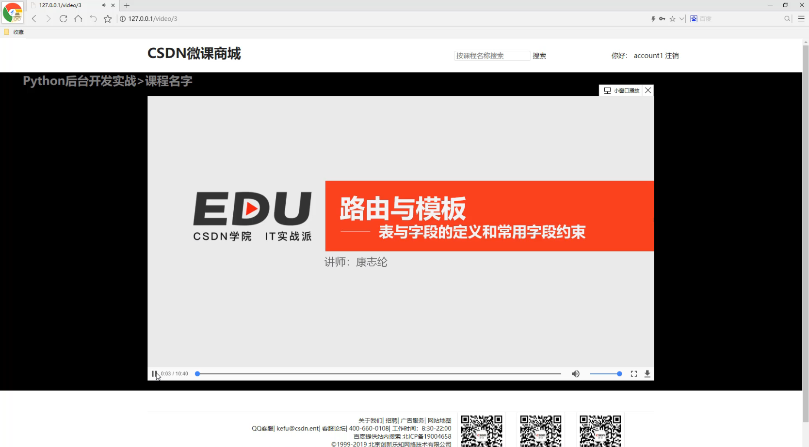

# 第四周作业3

## 1 作业描述

完善CSDN微课商城系统

在上次作业当中我们完成了后台管理的开发，这次我们完成前台的功能

### 1 .1 首页显示



### 1 .2 登录与注册



### 1 .3 课程详细页



### 1 .4 用户中心

 

### 1 .5 视频播放页

 

## 2 解题提示

### 2 .1 模板层的数据显示

模板层虽然可以通过的方式运行类似Python的代码，但这种方式远没有Python强大，故应该 把数据的处理尽可能在views视图函数中做好，不要把复杂的数据丢给模板层，即模板层的Python语句越简单、越少越好。

### 2 .2 关于视频流

视频流我们必须清楚HTTP协议中的三个关键字

#### 2 .2 .1 range

客户端告知服务器，想要获取哪部分的视频数据，通过range关键字（告诉服务器，需要的数据在 整个视频文件中的起始位置与终止位置） 在HTTP或HTTPS请求头中，range数据的格式一般这样： 

cmd range:bytes=100‐200 参数解释 ‐ 100表示索要的视频流的数据从索引100开始 ‐ 200表示索 要的视频流终点位置为视频文件索引200的位置（注：包括200索引位置的那个字节

对于后台服务器，我们一般只需要得到用户索要的起始位置，即上面举例的100，因为这往往和用户点击进度条有关，而终点位置由服务器决定 

#### 2.2.2 content‐lenght与content‐range

content‐length：服务器为客户端返回的字节大小 content‐range：服务器为客户端返回的字节对 应原视频文件的位置以及源文件的大小 

其中content‐range的格式一般如下： cmd content‐range:bytes 100‐200/300 表示这次返回的视频流数据，对应源文件的100索引位置到200索引位置，而源文件的总大小是300

### 2.3 视频观看权限问题

在中间件中判断每一个访问视频播放页的用户，判断他们： 

1. 用户是否登录 
2. 视频是否是免费的 

3. 对于非免费课程，用户是否购买了这个课程 

中间件代码：

```python
from django.utils.deprecation import MiddlewareMixin
from course import views as course_views
from django.shortcuts import reverse

class MyMiddleware(MiddlewareMixin):
    def __init__(self,get_response=None):
        super().__init__(get_response)
        # 初始化中间件
        print('init_mymiddleware')

    def process_request(self,request):
        request.context = dict(
            session_user = request.session['session_user'] if 'session_user' in request.session.keys() else None
        )
        # 权限判断
        if (not request.context['session_user']) \
                and (request.path.startswith('/video') or request.path.startswith('/user')) \
                and request.path not in [reverse('user_login'),reverse('user_register')]:
                request.context['login_message'] = '请先登录'
                return course_views.index_handler(request)

    def process_response(self,request,response):
        # 必须return response
        print('process_response')
        return response
```

## 3 评分标准

  1.完成首页、课程详细页展示功能  10分

  2.完成用户个人中心的开发  10分

  3.完成视频播放页、视频流优化  10分

  4.代码注释，规范10分

 